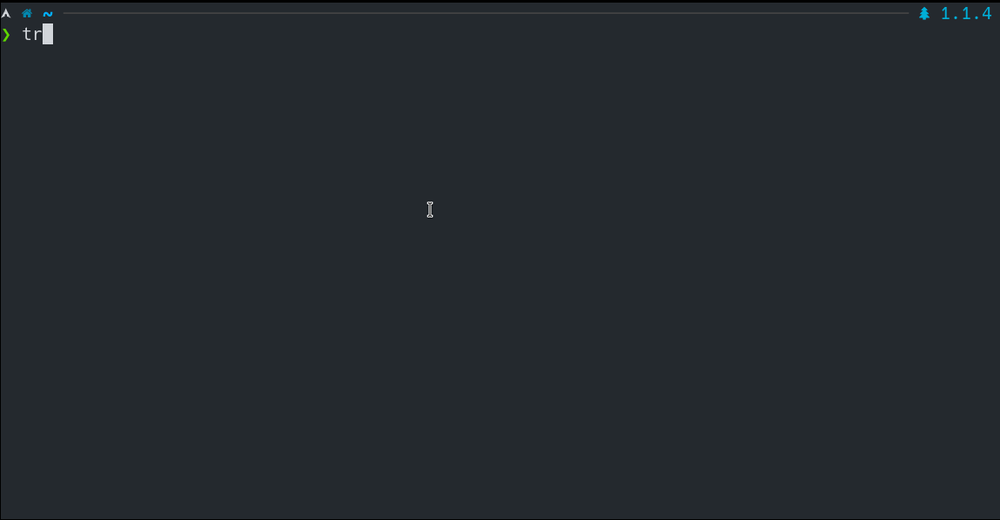

# Traitor

Automatically exploit low-hanging fruit to pop a root shell. Linux privilege escalation made easy!

Traitor packages up a bunch of methods to exploit local misconfigurations and vulnerabilities (including most of [GTFOBins](https://gtfobins.github.io/)) in order to pop a root shell.



It'll exploit most sudo privileges listed in GTFOBins to pop a root shell, as well as exploiting issues like a writable `docker.sock`. More routes to root will be added over time too.

## Usage

Run with no arguments to find potential vulnerabilities/misconfigurations which could allow privilege escalation. Add the `-p` flag if the current user password is known. The password will be requested if it's needed to analyse sudo permissions etc.

```bash
traitor -p
```

Run with the `-a`/`--any` flag to find potential vulnerabilities, attempting to exploit each, stopping if a root shell is gained. Again, add the `-p` flag if the current user password is known.

```bash
traitor -a -p
```

Run with the `-e`/`--exploit` flag to attempt to exploit a specific vulnerability and gain a root shell.

```bash
traitor -p -e docker:writable-socket
```

## Supported Platforms

Traitor will run on all Unix-like systems, though certain exploits will only function on certain systems.

## Getting Traitor

Grab a binary from the [releases page](https://github.com/liamg/traitor/releases), or use go:

```
CGO_ENABLED=0 go get -u github.com/liamg/traitor/cmd/traitor
```

If the machine you're attempting privesc on cannot reach GitHub to download the binary, and you have no way to upload the binary to the machine over SCP/FTP etc., then you can try base64 encoding the binary on your machine, and echoing the base64 encoded string to `| base64 -d > /tmp/traitor` on the target machine, remembering to `chmod +x` it once it arrives.
